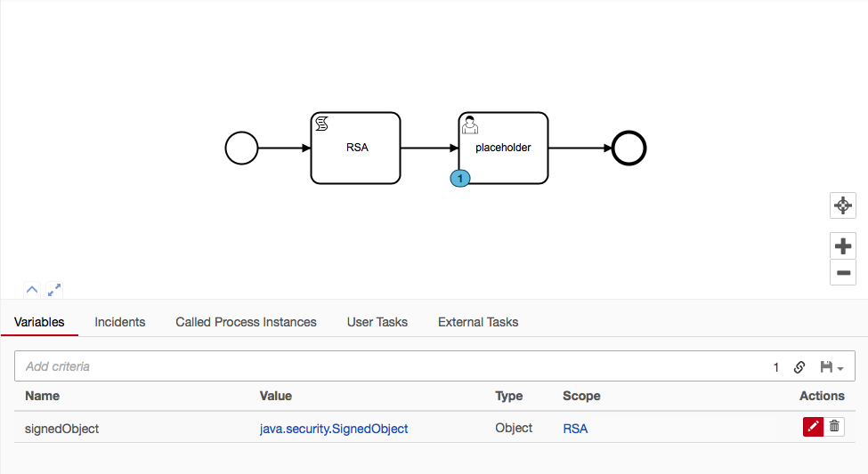
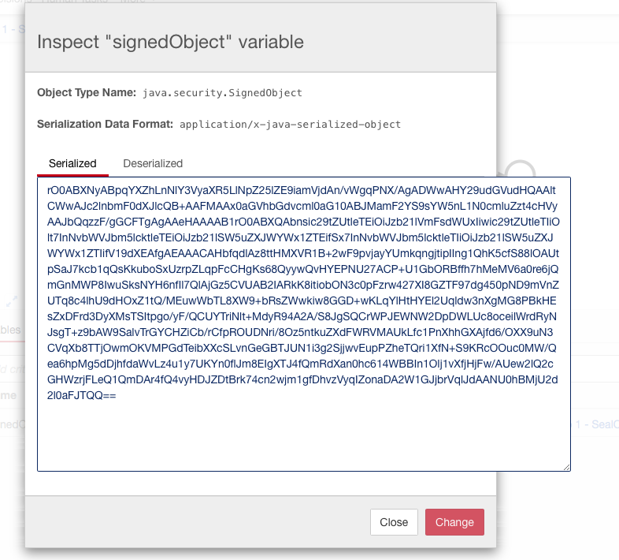
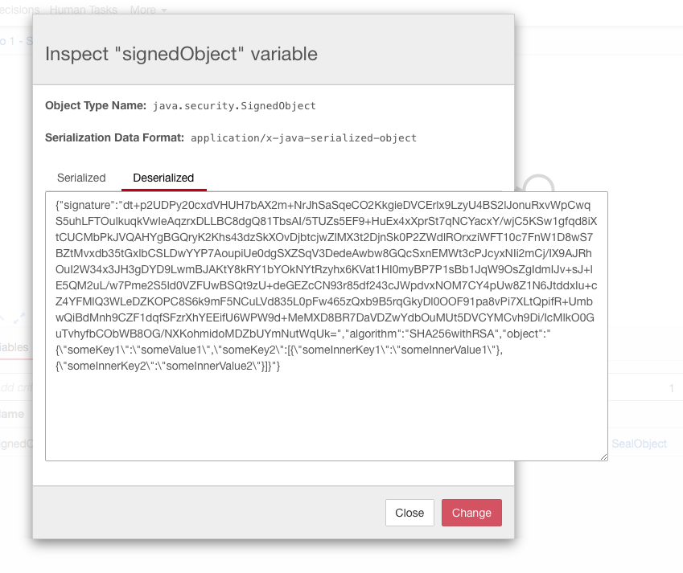

# Camunda BPM Process Variable RSA Encryption and Signed Object Pattern - Demo

The following is RSA encryption and Signed Object pattern for Camunda BPM variables using Nashorn Javascript

This is a demo deployment showing two concepts:

1. the execution of encryption being called directly in a Script task.  In practice the rsaEncrypt.js file would be called through `load('classpath:rsaEncrypt.js')`

1. Creating a Signed Object with SHA256 and RSA public and private keys.  Once the object is signed, you can also verify it.

## What does it do?

### Encryption

This allows you to leverage RSA encryption (Public and Private Key Encryption) for Camunda process variables.  Any data that you can serialize you can pass into the `rsaSeal(message, PUBLIC_KEY)` function which will encrypt the `message` using the public key, and wrap it all in a Java [SealedObject](https://docs.oracle.com/javase/8/docs/api/javax/crypto/SealedObject.html)

The below are screenshots of Camunda BPM Cockput UI showing the possible variable type creations. Where `encrypted_content` and `decrypted_content` are raw Strings/text that are from RSA encryption.  `sealed_object` and `unsealed_object` are RSA encryptions with the SealedObject class usage.

It is recomended that the SealObject (`rsaSeal()`) function always be used becuase of the Camunda 4000 character limit on process variables of type `String`.


### Signed Objects

Signed Objects allow you to add data into a SignedObject in the same way that a SealedObject is created, but a SignedObject is not encrypted, it is only signed using a Signature (`SHA256withRSA`).

See the `./source/rsaSignedObject.js` file for usage details.







# Camunda Docker

```bash
  docker run -d \
            --name camunda \
            -p 8080:8080 \
            -v /Users/MyUser/docker_volumes/bpm_keys:/bpm_keys \
            -e BPM_PUBLIC_KEY=/bpm_keys/public_key.der \
            -e BPM_PRIVATE_KEY=/bpm_keys/private_key.der \
            camunda/camunda-bpm-platform:tomcat-7.8.0
```

The rsaEncrypt.js and rsaSignedObject.js script is setup to load the public and private keys using paths provided by the `BPM_PUBLIC_KEY` and `BPM_PRIVATE_KEY` environment variables.


## Docker-Compose

Run: `docker-compose up`

Make sure to see the Environment Variables and the Volumes path for placing the .der / RSA Pem files.


## Dockerfile

For optimal usage, add the rsaEncrypt.js and rsaSignedObject.js files to the classpath such as:

Tomcat usage:

```dockerfile
FROM camunda/camunda-bpm-platform:tomcat-7.8.0

# add custom configurations
COPY docker/camunda/conf/ /camunda/conf

# add JS script for RSA encryption
COPY docker/camunda/lib/rsaEncrypt.js /camunda/lib/rsaEncrypt.js
COPY docker/camunda/lib/rsaSignedObject.js /camunda/lib/rsaSignedObject.js
```


# RSA Keys / .der / .pem files

To Generate RSA .der files:

1. `openssl genrsa -out private_key.pem 4096`
1. `openssl pkcs8 -topk8 -inform PEM -outform DER -in private_key.pem -out private_key.der -nocrypt`
1. `openssl rsa -in private_key.pem -pubout -outform DER -out public_key.der`

Add these files to your `BPM_PUBLIC_KEY` and `BPM_PRIVATE_KEY` env variable mappings.

# Usage

Raw usage is as follows:

## Sealing/Encrypting:

```javascript
load('classpath:rsaEncrypt.js')
var messageToSeal = 'This message is to be hidden'
var sealedObject = rsaSeal(messageToSeal, PUBLIC_KEY)
execution.setVariable('sealed_object', sealedObject)
```

## Unsealing/Decrypting:

```javascript
load('classpath:rsaEncrypt.js')
var sealedObject = execution.getVariable('sealed_object')
var unsealedObject = rsaUnseal(sealedObject, PRIVATE_KEY)
execution.setVariable('unsealed_object', unsealedObject)
```

## Signing and Verifying

Two main functions:

1. `signObject()`
2. `verifySignedObject()`

Example:

```js
load('classpath:rsaSignedObject.js')

var myJsonJs = {
  "someKey1": "someValue1",
  "someKey2": [
    {
      "someInnerKey1": "someInnerValue1"
    },
    {
      "someInnerKey2": "someInnerValue2"
    }
  ]
}

  // Convert JSON into SPIN Object and convert SPIN Object into SignedObject
var myJsonSpin = S(JSON.stringify(myJsonJs)) 
var mySignedObject = signObject(myJsonSpin.toString(), PRIVATE_KEY)

  // Save the SignedObject as a process variable
execution.setVariable('signedObject', mySignedObject)

  // Verify the SignedObject using the RSA Public Key
var verified = verifySignedObject(mySignedObject, PUBLIC_KEY)

  // Save the Verification response (boolean) as a process variable
execution.setVariable('verified1', verified)

/**
 * Get the SignedObject process variable, then verify the 
 * process variable using the public key, then save the 
 * verification response as a process variable
 */
var signedObjectGet = execution.getVariable('signedObject')
var verified2 = verifySignedObject(signedObjectGet, PUBLIC_KEY)
execution.setVariable('verified2', verified2)
```

## Notes

When the `load('classpath:rsaEncrypt.js')` (or the rsaSignedObject.js file) is called, the `PUBLIC_KEY` and `PRIVATE_KEY` variables are automatically populated based on the `env` variables, this can be updated manually with the `loadPublicKey()` and `loadPrivateKey()` functions.  See the specific js files for changing this behavior.

**See the rsaEncrypt.js and rsaSignedObject.js files for code comments and further customization examples.**